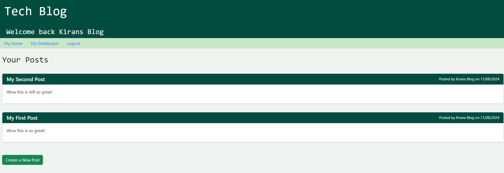

# Tech Blog

## Description
CMS-style blog site similar to a Wordpress site, where developers can publish their blog posts and comment on other developers’ posts as well.

## Table of Contents
- [Installation](#installation)
- [Usage](#usage)
- [License](#license)
- [Contributing](#contributing)
- [Tests](#tests)
- [Questions](#questions)

## Installation
Install dependencies with 'npm install', run 'npm start, create a blog post!'

Here is what the site should look like:

## Usage

Visit the link here to make a post! (Deployed with Render): [Website](https://tech-blog-w4dw.onrender.com)

## Licenses

## Contributing
For the repo, create a new branch for your changes, make modifications and submit pull request that folloes the projects coding standards

## Tests

## Questions
If you have any questions, please feel free to contact me:
- GitHub: [kiranross1999](https://github.com/kiranross1999)
- Email: kiran.ross@yahoo.com
